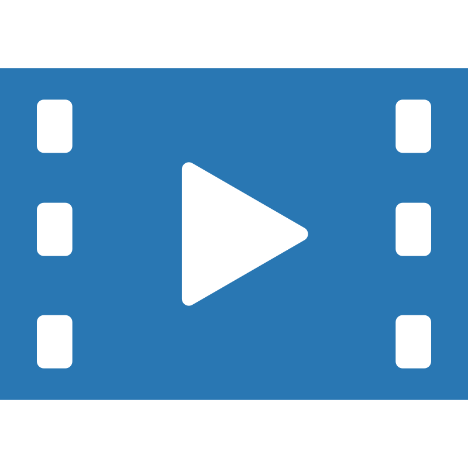
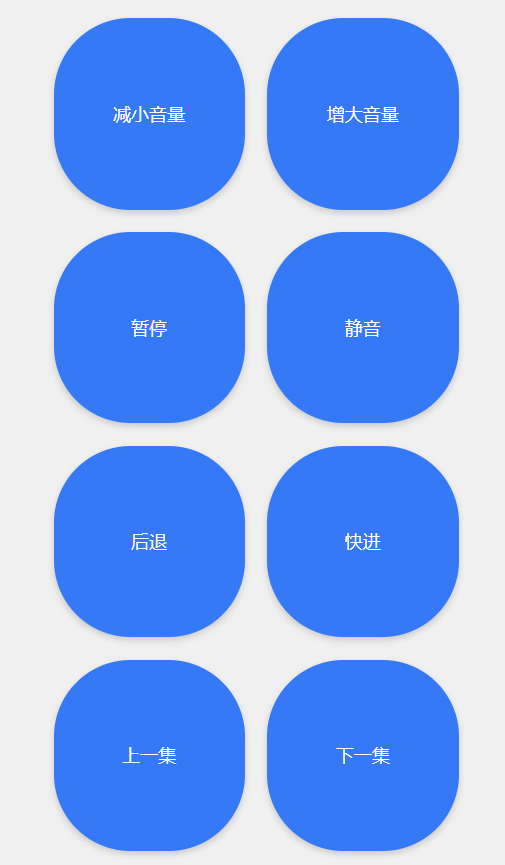
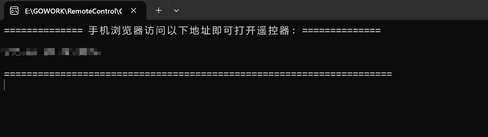
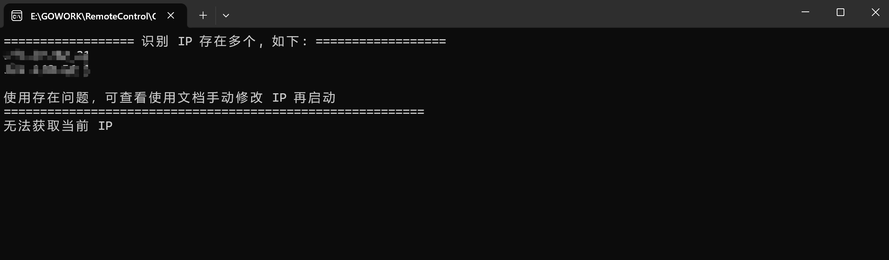
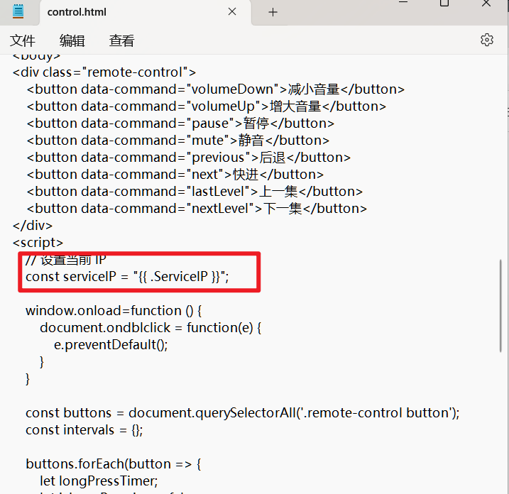

<h1>遥控器</h1>

**无需安装 双击启动**

**手机端页面**

**电脑端页面**

## Remote Control

因为有时候看剧的时候会躺床上看，调节音量或者操作电脑的行为什么的很麻烦，所以做了个工具来调节这些行为

### Q&A

如果启动的时候出现以下提示：

则需要手动修改一下配置

修改 `resource` 目录下 `control.html`  用**记事本**打开即可

找到这个地方修改为你的 `IP` 即可 比如你的 `IP` 是 `192.168.0.0` 那么就修改为 `const serviceIP = "192.168.0.0";`  手机浏览器则是访问 `192.168.0.0:9090` 即可

这个 `IP` 是和你的收集连接同一个网络的那个 `IP` 可以用命令行 `ipconfig` 来查询

